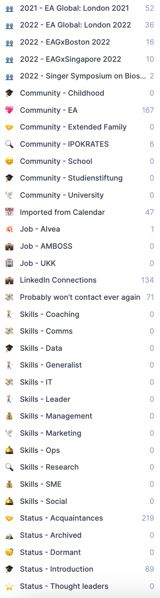
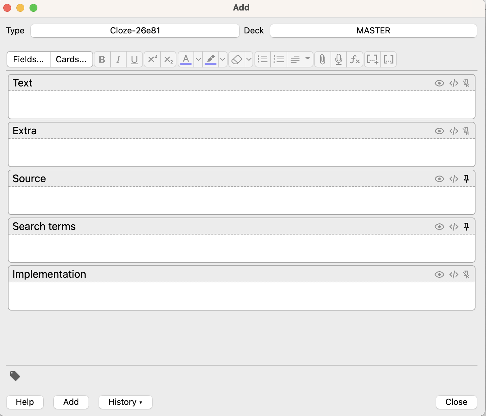

# Life-admin FAQ

Operational life infrastructure — tools, setups, processes. Updated irregularly; the date after each question's title marks the last revision.

---

## What is the portable laptop stand you use? (2022-07)

The [Nexstand K2](https://nexstand.eu/products/nexstand-k2-laptop-stand-1). Robust, adjustable height while the laptop is on it. Probably my single most useful computer gadget — prevents headaches from looking down at the screen.

I've tried [one other stand](https://www.therooststand.com/) which was thinner but didn't have in-use height adjustment.

## How do I organize my contacts? (2022-12)

I use [Dex](https://getdex.com/) as my contact management tool. Not perfect, but the best I've found.

The good:
- Import from many sources — easy for LinkedIn and Google accounts; Swapcard works if you convert the Excel export to CSV.
- Nice interface and shortcuts.
- Simple filters, saveable as views.
- Contact-rhythms sorting.
- Easy export of everything.
- Email forwarding lets you create contacts easily.

To optimize:
- Merge functionality doesn't catch all duplicates.
- No two-way sync with Apple / Google Contacts, and no integration with Apple Mail / Gmail.

I imported ~850 contacts, cleaned them up, and sorted them into groups / contact rhythms. Took ~5 hours. Most well-organized contacts list I've ever had.

Below are the groups I set up to help navigate. *Caveat:* I don't actually use these groups much in practice.

## How do I set up my computer? (2022-11)

[Video walkthrough (Loom)](https://www.loom.com/share/5dc675dc7b1041bb9f70518d84a74f9f).

## What do I use my PA for? (2023-05)

TLDR:

- Repetitive tasks taking more than 30 min (e.g. merging contacts across systems).
- Iterative research, especially life-admin topics.

A nice side effect: you have to articulate what you actually want. For example, I don't yet have a great description of what matters to me in accommodations, so my PA can't make strong decisions there. As my [life-admin manual](manual.md) expands, my PA gets more useful.

## Finance procedures I find valuable (2023-06)

> The budget categories below are ones I came up with for myself. Adapt them to your own life.

### Ops

- One separate credit card for tax-deductible payments (easy to find at year end).
- Weekly oversight across all accounts. I use [finanzblick](https://finanzblickx.buhl.de/login), which also lets you upload / forward invoices straight into your tax returns. I check for tax-relevant payments, weird payments, and tag things.
  - Sub-account for money I've lent to others or owe to others.
- Be smart about what you can declare for taxes — can easily save thousands (education invoices, work-related travel, etc.).
- Pay everything by card where you can, for easier oversight.

### Investments (all automated)

ETFs (percentages = share of monthly contribution):

- Lyxor Core MSCI World (DR) UCITS ETF — WKN LYX0YD (55%)
- iShares MSCI EM UCITS ETF USD — WKN A0RPWJ (25%)
- iShares MSCI World Small Cap UCITS ETF USD — WKN A2DWBY (7%)
- Crypto (self-managed hardware wallet) — Bitcoin (7%)
- Gold: EUWAX Gold II — WKN EWG2LD (7%)

Leveraging your own money (I've become more interested recently):

- Safest: buy a house.
- Some ETFs allow up to 2x leverage — riskier. E.g. Xtrackers S&P 500 2x Leveraged Daily Swap UCITS ETF 1C.

Rebalance every 1–2 years. I keep a net-worth overview listing all buckets and review whether the distribution still feels right.

### Goals / concrete numbers (2024-09-03)

Monthly expenses → ~3,500€ net:

- 750€ food
- 250€ health (gym + random expenses)
- 250€ miscellaneous (clothes, hygiene, public transport, etc.)
- 250€ buffer
- 1,250€ rent
- 750€ savings for vacation / fun events

Monthly savings:

- 750€ ETF investments
- Additional buffer used to refill emergency reserve

Monthly insurances + taxes:

- ~1k insurances
- ~1.5k taxes

→ ~5k net after insurances + taxes → min. yearly income 90–100k.

**"Never need to work" target:** based on [Gerd Kommer's safe-withdrawal table](https://gerd-kommer.de/medien/svs-abod-2022-03.pdf). That table is in 10k/month units, so roughly half the fourth column covers my current spending (assuming insurances and investments level out). At my current age that's a net worth of ~3M over the next 10y.

Additional principles:

- Keep 6 months of living expenses available.
- Talk with your parents about transferring money you might inherit early — parents tend not to invest well. :)

## How do I organize knowledge management in Anki? (2023-06)

**What goes in?** Anything I think is worth remembering. Commonly: life lessons, nice things people said about me, things I need to learn.

**How many decks?** One master deck. 30 cards / day; max 2 new per day. I use tags rather than separate decks for organization.

My card template (`Cloze-26e81`) has these fields:

**Do you also keep knowledge in Roam?**

- Roam / Logseq are for journaling and note-taking during check-ins. Permanent knowledge lives elsewhere.
- Process knowledge: this FAQ and the [professional FAQ](../professional/faq.md).
- Checklists: [atext](https://www.trankynam.com/atext/).
- Most other knowledge: Anki.

**How do you transfer Roam notes into Anki cards?** Manually. Often I open Anki immediately to add things. Otherwise a weekly checklist item prompts me to add new things.
